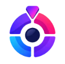

<p align="center">
  
</p>

<h1 align="center">Spinly</h1>

<p align="center">
  A prize wheel for giveaways, raffles and everyday decisions.<br />
  <a href="https://spinly-psi.vercel.app"><strong>Live demo →</strong></a>
</p>

<p align="center">
  
  
  
  
  
</p>

---

## 🎡 The idea

Most online wheels are a picture that turns. Spinly treats the wheel as the centre of a small app: you design it, it ticks as it slows down, it plays your music while you spin, and it follows you to any device.

- **Build** a wheel with up to 25 options, each sector with its own color or an image fitted by hand.
- **Spin** it and watch the pointer tick across each sector until a dialog announces the winner.
- **Save** the look as a *theme* or the whole wheel as a *preset*, and share both with the community.
- **Play** your own playlist in the background, with separate volumes for music and sound effects.
- **Sign in** with just a username and password, and everything is there on your next device.

With no backend configured it still works end to end: everything lives in the browser, and accounts and the community are an optional layer on top.

## 🔧 How it's built

It was fun to figure out certain things. And here's how it works:

### The wheel is plain CSS
There is no canvas or game engine behind the wheel. Its sectors are a single `conic-gradient`, and sectors with images are SVG paths clipped to the same angles. To spin, the app **picks the winner first**, adds a random offset inside that sector plus five to seven full turns, and lets a CSS transition with a long ease-out curve do the rest. The labels are sized from the sector's chord, so long names shrink instead of spilling into the next slice.

### A tick that listens to the animation
The ticking sound is not on a timer. On every frame, the app reads the disc's real angle from its computed `transform` matrix and plays a tick each time a sector border passes the pointer. As the transition slows down, the ticks slow down with it, just like a physical wheel.

### Sound effects without a single audio file
Every click, tick and winner chime is synthesized with the **Web Audio API**: oscillators with pitch sweeps, shaped by short gain envelopes. One listener on `document` handles every button in the app, and a volume curve (the slider value squared) makes the effects slider feel even from start to end.

### Your music, on every device
Songs you upload are stored twice: in **IndexedDB** for instant playback (a few megabytes per song would not fit in `localStorage`), and in your **private folder in Supabase Storage** so the playlist follows your account. The playlist itself is a small list that travels in the same sync file as your wheels.
- Songs added without an account wait in a local queue and upload themselves after you sign in.
- On a new device a song downloads the first time you play it, then stays cached.
- Each song plays through its own gain node, so changing tracks is a short **crossfade** rather than a cut.
- The **Media Session API** puts the current song on the lock screen and wires up the media keys.

### Lights that follow the beat
While a song plays, the wheel lights and the dotted background move with it. They follow the pulse, not individual hits:
- **Before it plays**, the whole file is decoded with `decodeAudioData` and analysed in a **Web Worker**. The worker computes a spectral-flux onset curve and estimates the tempo by autocorrelation between 70 and 180 BPM, correcting double- and half-tempo errors. A dynamic-programming beat tracker then places every beat, and the bar is found from the strongest bass hits.
- **Until that finishes**, a real-time tracker runs like a phase-locked loop. It predicts the next beat, nudges its phase with each nearby onset, keeps time through silences, and relocks within a few beats after a tempo change.
- **The clock is the audio clock.** Each pulse is timed on `AudioContext.currentTime` in song time, minus the context and output latency, so it lands when you *hear* the beat, not when the analyser sees it.

Each song gets one effect at a time, chosen from how it sounds: a beating rim with rings, a chase, sparkles, or a flower that blooms from the wheel. Effects change every four bars, exactly on the first beat of a bar, and the first beat of each bar gets a stronger accent. Synthetic test songs cover the hard cases: straight time, swing, a tempo change, a pause and a long reverb tail.

### A background that notices you
The dotted background behind the wheel is drawn on a `<canvas>`. A slow diagonal wave runs across the dots, and the ones near your cursor drift away, grow and light up in the accent color, easing in and out instead of snapping. To keep it cheap, dots of similar brightness are batched into a handful of `Path2D` fills per frame, the animation drops to 30 fps when nobody is interacting, and it pauses entirely off screen or with reduced motion enabled.

### A cursor with a little inertia
With a mouse, the system cursor becomes a dot and a trailing ring. The ring follows with exponential smoothing that depends on elapsed time, not frame rate, so it feels the same at 60 Hz and 144 Hz, and it stretches in the direction you move. Like a system cursor, it is drawn as a white stroke with a thin dark outline, so it stays visible over light panels, dark buttons and every wheel color. Where the system cursor means something (text fields, drag handles, the eyedropper) the custom one steps aside.

### An eyedropper for every browser
- **Chrome, Edge and Opera** use the native `EyeDropper` API, which can pick from anywhere on screen.
- **Firefox and Safari** capture a single frame of a screen, window or tab with the Screen Capture API, then let you pick on it with a pixel magnifier.
- **Mobile** picks from a photo or screenshot as you drag a finger across it.

### A loading screen that paints before JavaScript
The splash lives in `index.html` itself, so it appears on the very first paint instead of a blank page. The logo is redrawn as inline SVG so its four sectors can assemble and spin into place, over a slowly drifting aurora. A tiny inline script applies your light or dark preference before anything paints. Its hash is part of the Content Security Policy, and the build fails if the two ever drift apart. Once React has mounted underneath, the splash dissolves.

### Accounts without email
Supabase Auth requires an email, so each account gets an internal address derived from its immutable user id on the reserved `.invalid` domain, which can never receive mail. Signing in resolves the username to that id, and the app then checks that the session really belongs to it, so one account cannot impersonate another.

### Cross-device sync
Each account is one private JSON document in Storage. Changes upload about 1.5 s after the last edit, and immediately when the tab is hidden. On startup the app compares its local sync marker with the cloud copy and applies anything newer from another device. Signing out is refused if pending changes could not be saved, and it leaves the browser exactly as a first visit.

### Lighthouse 100, and what the splash taught me
Only what the first paint needs is shipped: panels, the color picker, the music player and the winner dialog load on demand, the Supabase SDK is never downloaded for visitors without a session, and the main stylesheet is inlined at build time. Adding the splash made the first paint arrive earlier, which exposed start-up work that used to be hidden before it. Three fixes brought the score back:
- the first render runs inside `startTransition`, so it yields to the browser;
- the canvas measures itself in a `ResizeObserver` callback instead of forcing a synchronous layout;
- a percentage formatter no longer creates an `Intl.NumberFormat` on every render.

### Security
- **Row level security** means users can only edit or delete what they own. Column grants keep ownership fields immutable.
- **Everything is sanitized** on the way in, from `localStorage`, Supabase or the sync file: colors must be hex, images raster `data:` URLs, songs a known audio type within the size limit, and file paths are built only from validated ids.
- **Strong passwords** are required: at least 10 characters with lowercase, uppercase, a number and a symbol, and without the username. A live checklist updates as you type.
- **Hardened headers:** a strict CSP with no third-party origins, clickjacking protection and HSTS.
- **Brute-force friction:** a growing pause after failed sign-ins, and signing out ends only the current device's session.

## 🧱 Architecture

Dependencies flow one way: components and hooks use `scripts` and `types`, which never import React.

```
src/
├── Components/   React UI by feature: wheel, editor, presets, themes, music, layout, common, i18n
├── hooks/        UI logic: sorting, sounds, account sync, community data, media queries
├── scripts/      Framework-free: wheel geometry, color math, sound and music engines,
│                 screen capture, song storage, strings, Supabase services
├── types/        Theme and preset models and their sanitizers
└── css/          Per-component styles on a shared set of design tokens
```

| Technology | Role |
| --- | --- |
| **React 19 + TypeScript** | UI, services and data models, strictly typed |
| **Plain CSS** with custom properties | No UI library; light and dark themes from design tokens, BEM-style `spinly-*` classes |
| **Supabase** | Auth, Postgres with row level security, and Storage for avatars, sync and songs |
| **Web Audio, Canvas, IndexedDB** | Sound effects, the music player, the dotted background and the song cache |
| **EyeDropper, Screen Capture and Media Session APIs** | The eyedropper and lock-screen music controls |
| **Jest + Testing Library** | 66 tests covering the UI, the data models, music, beat tracking and the account flows |
| **Vercel** | Static hosting with a strict Content Security Policy |
| **pnpm** | Dependencies, plus two patches that keep Create React App working on Node 24 |

## 🚀 Run it locally

Requires **Node 18+** and **[pnpm](https://pnpm.io)**.

```bash
pnpm install
pnpm start        # http://localhost:3000
```

With no configuration the app runs **fully offline**. To enable accounts, sync and the community, add a `.env.local` file pointing to a Supabase project:

```bash
REACT_APP_SUPABASE_URL=https://<your-project>.supabase.co
REACT_APP_SUPABASE_ANON_KEY=<anon key>
```

<details>
<summary>Supabase project requirements</summary>

- **Tables:** `profiles`, `shared_themes` and `shared_presets`, with row level security.
- **Storage:**
  - a public `avatars` bucket, limited to PNG, JPEG and WEBP up to 2 MB;
  - a private `user-data` bucket for account sync and songs, where each user can only access their own folder and anonymous sessions can't write. It accepts JSON and audio (`audio/mpeg`, `audio/mp4`, `audio/aac`, `audio/ogg`, `audio/wav`, `audio/webm`, `audio/flac`) up to 10 MB per file, with select, insert, update and delete policies.
- **Authentication:**
  - the Email provider enabled, with **Confirm email** off;
  - **anonymous sign-ins** enabled;
  - passwords of at least **10** characters with lowercase, uppercase, digits and symbols.

</details>

| Command | Description |
| --- | --- |
| `pnpm start` | Development server with hot reload |
| `pnpm build` | Production build in `build/` (also checks the CSP hashes) |
| `pnpm test:ci` | Run the test suite once |
| `pnpm typecheck` | Type-check the project |

## 👤 Author

Designed and built by **Jonathan Dorado Quintero** · [GitHub @Jondals](https://github.com/Jondals)
